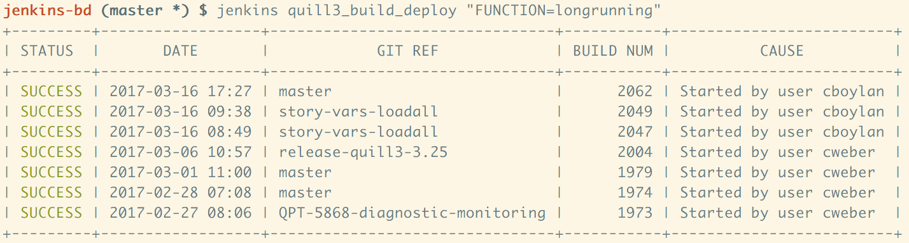

JENKINS
-------

`jenkins` is a CLI for querying a Jenkins job for build status and description.

## Installation

1. `go get github.com/ns-cweber/jenkins-cli/cmd/jenkins`
2. `echo "export JENKINS_HOST_URL={host_url}" >> ~/.bash_profile`

## Usage

`jenkins [<job_name>]`

### Environment Variables

- `JENKINS_HOST_URL` (required): The Jenkins host address
- `JENKINS_DEFAULT_JOB` (optional): The default job to query for
